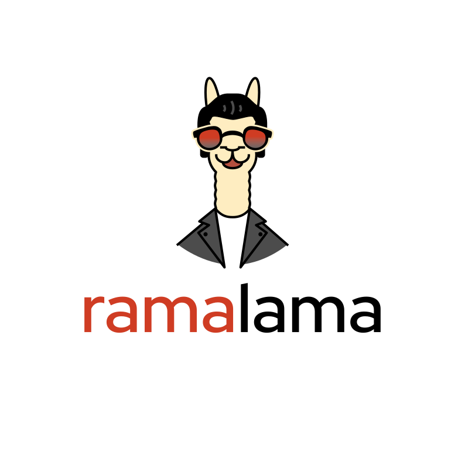

# RamaLama

The RamaLama project's goal is to make working with AI boring
through the use of OCI containers.

On first run RamaLama inspects your system for GPU support, falling back to CPU
support if no GPUs are present. It then uses container engines like Podman or
Docker to pull the appropriate OCI image with all of the software necessary to
run an AI Model for your systems setup. This eliminates the need for the user
to configure the system for AI themselves. After the initialization, RamaLama
will run the AI Models within a container based on the OCI image.

RamaLama supports multiple AI model registries types called transports.
Supported transports:


## TRANSPORTS

| Transports    | Web Site                                            |
| ------------- | --------------------------------------------------- |
| HuggingFace   | [`huggingface.co`](https://www.huggingface.co)      |
| Ollama        | [`ollama.com`](https://www.ollama.com)              |
| OCI Container Registries | [`opencontainers.org`](https://opencontainers.org)|
||Examples: [`quay.io`](https://quay.io),  [`Docker Hub`](https://docker.io), and [`Artifactory`](https://artifactory.com)|

RamaLama uses the Ollama registry transport by default. Use the RAMALAMA_TRANSPORTS environment variable to modify the default. `export RAMALAMA_TRANSPORT=huggingface` Changes RamaLama to use huggingface transport.

Individual model transports can be modifies when specifying a model via the `huggingface://`, `oci://`, or `ollama://` prefix.

`ramalama pull huggingface://afrideva/Tiny-Vicuna-1B-GGUF/tiny-vicuna-1b.q2_k.gguf`

To make it easier for users, RamaLama uses shortname files, which container
alias names for fully specified AI Models allowing users to specify the shorter
names when referring to models. RamaLama reads shortnames.conf files if they
exist . These files contain a list of name value pairs for specification of
the model. The following table specifies the order which Ramama reads the files
. Any duplicate names that exist override previously defined shortnames.

| Shortnames type | Path                                            |
| --------------- | ---------------------------------------- |
| Distribution    | /usr/share/ramalama/shortnames.conf      |
| Administrators  | /etc/ramamala/shortnames.conf            |
| Users           | $HOME/.config/ramalama/shortnames.conf   |

```code
$ cat /usr/share/ramalama/shortnames.conf
[shortnames]
  "tiny" = "ollama://tinyllama"
  "granite" = "huggingface://instructlab/granite-7b-lab-GGUF/granite-7b-lab-Q4_K_M.gguf"
  "granite:7b" = "huggingface://instructlab/granite-7b-lab-GGUF/granite-7b-lab-Q4_K_M.gguf"
  "ibm/granite" = "huggingface://instructlab/granite-7b-lab-GGUF/granite-7b-lab-Q4_K_M.gguf"
  "merlinite" = "huggingface://instructlab/merlinite-7b-lab-GGUF/merlinite-7b-lab-Q4_K_M.gguf"
  "merlinite:7b" = "huggingface://instructlab/merlinite-7b-lab-GGUF/merlinite-7b-lab-Q4_K_M.gguf"
...
```

## Install

## Install via PyPi

RamaLama is available via PyPi [https://pypi.org/project/ramalama](https://pypi.org/project/ramalama)

```
pipx install ramalama
```

## Install by script

Install RamaLama by running this one-liner (on macOS run without sudo):

Linux:

```
curl -fsSL https://raw.githubusercontent.com/containers/ramalama/s/install.sh | sudo sh
```

macOS:

```
curl -fsSL https://raw.githubusercontent.com/containers/ramalama/s/install.sh | sh
```

## Hardware Support

| Hardware                           | Enabled |
| ---------------------------------- | ------- |
| CPU                                | :white_check_mark: |
| Apple Silicon GPU (macOS)          | :white_check_mark: |
| Apple Silicon GPU (podman-machine) | :x: |
| Nvidia GPU (cuda)                  | :x: |
| AMD GPU (rocm)                     | :x: |

## COMMANDS

| Command                                                | Description                                                |
| ------------------------------------------------------ | ---------------------------------------------------------- |
| [ramalama(1)](docs/ramalama.1.md)                      | primary RamaLama man page                                  |
| [ramalama-containers(1)](docs/ramalama-containers.1.md)| list all RamaLama containers                               |
| [ramalama-list(1)](docs/ramalama-list.1.md)            | list all downloaded AI Models                              |
| [ramalama-login(1)](docs/ramalama-login.1.md)          | login to remote registry                                   |
| [ramalama-logout(1)](docs/ramalama-logout.1.md)        | logout from remote registry                                |
| [ramalama-pull(1)](docs/ramalama-pull.1.md)            | pull AI Model from Model registry to local storage         |
| [ramalama-push(1)](docs/ramalama-push.1.md)            | push AI Model from local storage to remote registry        |
| [ramalama-rm(1)](docs/ramalama-rm.1.md)                | remove AI Model from local storage                         |
| [ramalama-run(1)](docs/ramalama-run.1.md)              | run specified AI Model as a chatbot                        |
| [ramalama-serve(1)](docs/ramalama-serve.1.md)          | serve REST API on specified AI Model                       |
| [ramalama-stop(1)](docs/ramalama-stop.1.md)            | stop named container that is running AI Model              |
| [ramalama-version(1)](docs/ramalama-version.1.md)      | display version of AI Model                                |

## Usage

### Running Models

You can `run` a chatbot on a model using the `run` command. By default, it pulls from the ollama registry.

Note: RamaLama will inspect your machine for native GPU support and then will
use a container engine like Podman to pull an OCI container image with the
appropriate code and libraries to run the AI Model. This can take a long time to setup, but only on the first run.
```
$ ramalama run instructlab/merlinite-7b-lab
Copying blob 5448ec8c0696 [--------------------------------------] 0.0b / 63.6MiB (skipped: 0.0b = 0.00%)
Copying blob cbd7e392a514 [--------------------------------------] 0.0b / 65.3MiB (skipped: 0.0b = 0.00%)
Copying blob 5d6c72bcd967 done  208.5MiB / 208.5MiB (skipped: 0.0b = 0.00%)
Copying blob 9ccfa45da380 [--------------------------------------] 0.0b / 7.6MiB (skipped: 0.0b = 0.00%)
Copying blob 4472627772b1 [--------------------------------------] 0.0b / 120.0b (skipped: 0.0b = 0.00%)
>
```

After the initial container image has been downloaded, you can interact with
different models, using the container image.
```
$ ramalama run granite-code
> Write a hello world application in python

print("Hello World")
```

In a different terminal window see the running podman container.
```
$ podman ps
CONTAINER ID  IMAGE                             COMMAND               CREATED        STATUS        PORTS       NAMES
91df4a39a360  quay.io/ramalama/ramalama:latest  /home/dwalsh/rama...  4 minutes ago  Up 4 minutes              gifted_volhard
```

### Listing Models

You can `list` all models pulled into local storage.

```
$ ramalama list
NAME                                                                MODIFIED     SIZE
ollama://tiny-llm:latest                                            16 hours ago 5.5M
huggingface://afrideva/Tiny-Vicuna-1B-GGUF/tiny-vicuna-1b.q2_k.gguf 14 hours ago 460M
ollama://granite-code:3b                                            5 days ago   1.9G
ollama://granite-code:latest                                        1 day ago    1.9G
ollama://moondream:latest                                           6 days ago   791M
```
### Pulling Models

You can `pull` a model using the `pull` command. By default, it pulls from the ollama registry.

```
$ ramalama pull granite-code
###################################################                       32.5%
```

### Serving Models

You can `serve` multiple models using the `serve` command. By default, it pulls from the ollama registry.

```
$ ramalama serve --name mylama llama3
```

### Stopping servers

You can stop a running model if it is running in a container.

```
$ ramalama stop mylama
```

## Diagram

```
+---------------------------+
|                           |
| ramalama run granite-code |
|                           |
+-------+-------------------+
	|
	|
	|                                          +------------------+
	|                                          | Pull model layer |
	+----------------------------------------->| granite-code     |
						   +------------------+
						   | Repo options:    |
						   +-+-------+------+-+
						     |       |      |
						     v       v      v
					     +---------+ +------+ +----------+
					     | Hugging | | quay | | Ollama   |
					     | Face    | |      | | Registry |
					     +-------+-+ +---+--+ +-+--------+
						     |       |      |
						     v       v      v
						   +------------------+
						   | Start with       |
						   | llama.cpp and    |
						   | granite-code     |
						   | model            |
						   +------------------+
```

## In development

Regard this alpha, everything is under development, so expect breaking changes, luckily it's easy to reset everything and re-install:

```
rm -rf /var/lib/ramalama # only required if running as root user
rm -rf $HOME/.local/share/ramalama
```

and install again.

## Credit where credit is due

This project wouldn't be possible without the help of other projects like:

llama.cpp
whisper.cpp
vllm
podman
omlmd
huggingface

so if you like this tool, give some of these repos a :star:, and hey, give us a :star: too while you are at it.

## Community

[`Matrix`](https://matrix.to/#/#ramalama:fedoraproject.org)

## Contributors

Open to contributors

<a href="https://github.com/containers/ramalama/graphs/contributors">
  
</a>
