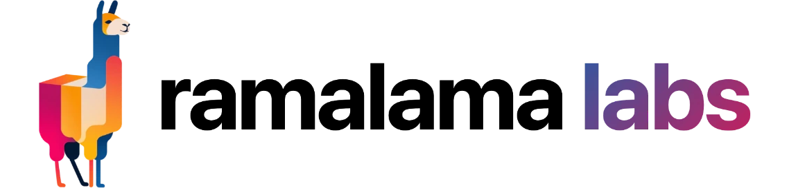

<p align="center">
  <picture>
    <source media="(prefers-color-scheme: dark)" srcset="assets/lockup-dark.webp">
    
  </picture>
</p>
&nbsp;
&nbsp;
<p align="center">
  <strong>Programmable AI on any device.</strong><br/>
  Run LLMs locally on any hardware. If you can build a container you can deploy AI.
</p>

<p align="center">
  <a href="https://github.com/containers/ramalama/issues">
    
  </a>
  <a href="https://github.com/containers/ramalama">
    
  </a>
  <a href="https://github.com/containers/ramalama/blob/main/LICENSE">
    
  </a>
  <a href="https://discord.gg/cFyDXs9nS9">
    
  </a>
</p>


---

[RamaLama](https://github.com/containers/ramalama) is an open source container orchestration system which makes working with AI simple, straightforward, and familiar using OCI containers.

Ramalama lets you add AI features to your local application while running entirely on device. It can be used on any device with an applicable container manager like docker or podman with support for most model repositories.

## Capabilities

- **LLM chat** with OpenAI-compatible endpoints for direct requests.
- **Speech-to-Text (STT)** with Whisper (coming soon).
- **Runtime Agnostic** with default builds for llama.cpp, vLLM, and mlx
- **Model Provider Agnostic** work with models from huggingface, ollama, modelscope, any OCI registry, local files and URLs.

## Installation

### Requirements

- Docker or Podman running locally.
- Python 3.10+
  
### PyPi

```bash
pip install ramalama-sdk
```


## Quick Start

### Python

#### Basic Chat

```python
from ramalama_sdk import RamalamaModel

with RamalamaModel(model="tinyllama") as model:
    response = model.chat("How tall is Michael Jordan")
    print(response["content"])
```

```text
Michael Jordan is 6 feet 6 inches (1.98 m) tall.
```

For multiturn conversations the chat method accepts an additional history argument which can also be used to set system prompts.

```python
sys_prompt = {
  "role": "system", 
  "content": "Pretend you were a dog and respond with variations of bark and woof."
}
history = [sys_prompt]
with RamalamaModel(model="tinyllama") as model:
    response = model.chat("How tall is Michael Jordan?", history)
    print(response["content"])
```

```text
Woof woof. Bark bark bark. Rrr-woooooof.
Arf arf arf arf arf arf. Ruff!
```

#### Model Management

Models can be pulled from a variety of sources including HuggingFace, Ollama, ModelScope, any OCI registry, local files, and any downloadable URL.

```python
with RamalamaModel(model="hf://ggml-org/gpt-oss-20b-GGUF") as model:
    response = model.chat("How tall is Michael Jordan")
    print(response["content"])
```

The full suite of supported prefixes can be found below.

| Transport | Prefixes/Schemes | Description |
|-----------|------------------|-------------|
| huggingface | `huggingface://`, `hf://`, `hf.co/` | HuggingFace model hub |
| modelscope | `modelscope://`, `ms://` | ModelScope  |
| ollama | `ollama://`, `ollama.com/library/` | Ollama model library |
| rlcr | `rlcr://` | Ramalama Container Registry |
| oci | `oci://`, `docker://` | OCI container images / Docker registries |
| url | `http://`, `https://` | Generic URLs (HTTP/HTTPS) |
| file | `file://` | Local file paths |

#### Runtime Customization

The Model exposes a variety of customization parameters including `base_image` which allows you to customize the model container runtime. This is especially useful if you need to run inference on custom hardware which requires a specifically compiled version of llama.cpp, vLLM, etc...

```python
from ramalama_sdk import RamalamaModel

model = RamalamaModel(
    model="tinyllama",
    base_image="artifactory.corp.com/llama-runtime:prod",
    temp=0.7,
    ngl=20,
    max_tokens=256,
    threads=8,
    ctx_size=4096,
    timeout=30,
)
```

| Field       | Type          | Description                                                   | Default |
|-------------|---------------|---------------------------------------------------------------|---------|
| model       | str           | Model name or identifier.                                     | required |
| base_image  | str   | Container image to use for serving, if different from config. | quay.io/ramalama/ramalama    |
| temp        | float | Temperature override for sampling.                            | 0.8    |
| ngl         | int   | GPU layers override.                                          | -1 (all)   |
| max_tokens  | int   | Maximum tokens for completions.                               | 0  (unlimited)   |
| threads     | int   | CPU threads override.                                         | -1 (all)   |
| ctx_size    | int   | Context window override.                                      | 0 (loaded from the model)    |
| timeout     | int           | Seconds to wait for server readiness.                         | 30      |

#### Async Models

The Async model API is identical to the sync examples above.

```python
from ramalama_sdk import AsyncRamalamaModel

async with AsyncRamalamaModel(model="tinyllama") as model:
    response = await model.chat("How tall is Michael Jordan")
    print(response["content"])
```

### Documentation

* Python SDK: https://docs.ramalama.com/sdk/python
* Quick start: https://docs.ramalama.com/sdk/python/quickstart
  
## SDKs

| Platform | Status | Installation | Documentation |
|----------|--------|--------------|---------------|
| **python** | Active Development | [pypi](#python) | [docs.ramalama.com/sdk/python](https://docs.ramalama.com/sdk/python/introduction) |
| **TypeScript** | planned | -- | -- |
| **Go** | planned | -- | -- |
| **Rust** | planned | -- | -- |

## Repository Structure

```text
.
├── assets/                   # Branding assets
├── sdk/                      # SDK implementations
│   └── ramalama-python       # Python SDK package
│   └── ramalama-go           # Go SDK package
├── LICENSE
└── README.md
```